<div align="center">
  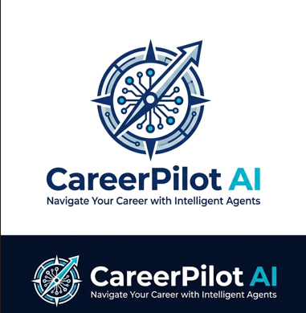
</div>

<div align="center">

# CareerPilot AI

### An Agentic AI-powered Multi-Agent Career Mentor System for Resume Analysis, Skill Gap Detection, Career Roadmaps, Interview Preparation, and Personalized Career Intelligence.

</div>

<div align="center">

[](https://python.org)
[](https://streamlit.io)
[](https://groq.com)
[](https://crewai.com)
[](https://github.com/hemendra-opensource/CareerPilot-AgenticAI)
[](https://www.reportlab.com/)

</div>

<div align="center">
  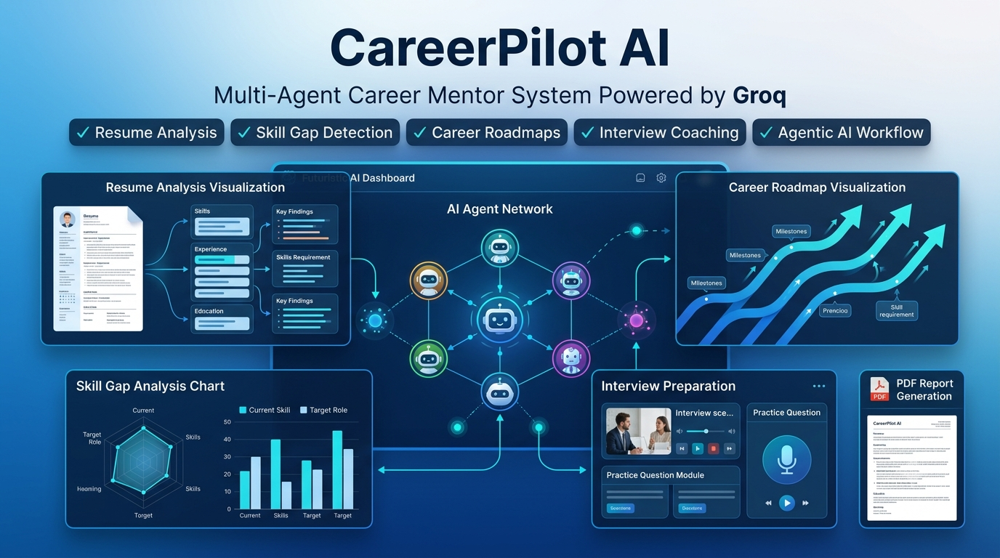
</div>

---

## Introduction & System Overview

**CareerPilot AI** is an Agentic AI project that uses multiple specialized AI agents working collaboratively to evaluate resumes, identify skill gaps, generate learning roadmaps, recommend portfolio projects, and prepare users for interviews.

Leveraging a structured team of specialized autonomous agents coordinated by a centralized master agent, the platform automates resume analysis, skill gap auditing, dynamic roadmap generation, mock interview coaching, portfolio project recommendations, and comprehensive career report compiling.

The application operates in two distinct execution modes:
1. **Manual Mode**: A step-by-step interactive workspace where users can run and refine results stage-by-stage.
2. **Agentic Mode**: A fully autonomous pipeline that uses a sequential workflow powered by a custom LLM orchestration wrapper to run all agents in a single pass.

---

## Quick Navigation

- [Features](#-features)
- [System Architecture](#-system-architecture)
- [Working Flow](#-working-flow)
- [Agent Communication](#-agent-communication)
- [Shared Memory Architecture](#-shared-memory-architecture)
- [Decision Engine](#-decision-engine)
- [LLM Integration Architecture](#-llm-integration-architecture)
- [PDF Report Generation Pipeline](#-pdf-report-generation-pipeline)
- [Technology Stack](#-technology-stack)
- [Project Structure](#-project-structure)
- [Screenshots](#-screenshots)
- [Installation & Local Setup](#-installation--local-setup)
- [Environment Variables Config](#-environment-variables-config)
- [Future Enhancements](#-future-enhancements)
- [Resume Project Description](#-resume-project-description)
- [Why This Project Matters](#-why-this-project-matters)
- [Author](#-author)

---

## Features

The system offers a comprehensive set of features divided into specialized agent-led domains:

| Module / Agent | Core Capability | Recruiter/Hiring Value |
| :--- | :--- | :--- |
| ** Resume Analyzer** | PyPDF2-based text extraction, structured parsing of work experience/education, and a rule-based ATS completeness scoring engine. | Audits baseline resume formatting and highlights immediately visible profile deficiencies. |
| ** Skill Gap Analyst** | Deterministic comparison of candidate skills against a target role database containing standard industry competencies. | Quantifies candidate capability mismatch with a precise gap percentage. |
| ** Roadmap Strategist** | Automatically generates a customized monthly learning curriculum divided into Beginner, Intermediate, and Advanced stages. | Provides a structured path forward with target timelines for transition. |
| ** Interview Coach** | Curates role-specific mock interview sheets (Technical, HR, Scenario Q&A) and computes a comprehensive readiness score. | Simulates real-world interviewer behavior and catches soft/hard skill risks. |
| ** Project Mentor** | Recommends targeted capstone and baseline projects dynamically prioritized using a 4-factor composite scoring engine. | Ranks project recommendations by their capability to close the user's specific skill gaps. |
| ** Master Career Agent** | Consolidates all diagnostic outputs. Computes Career Health and Hiring Readiness grades and formulates an actionable action plan. | Formulates a unified executive career strategy. |
| ** PDF Reports** | Generates a styled, multi-page downloadable PDF report using ReportLab. | Recruiters and mentors receive a shareable, easy-to-read candidate profile audit. |
| ** Shared Memory** | A stateful memory architecture that propagates agent outputs sequentially downstream without redundant LLM calls. | Assures state persistence and consistent advice across the entire user session. |

---

## System Architecture

Immediately below is the core blueprint mapping out how data moves through the sequential multi-agent workforce to produce a unified career assessment report.

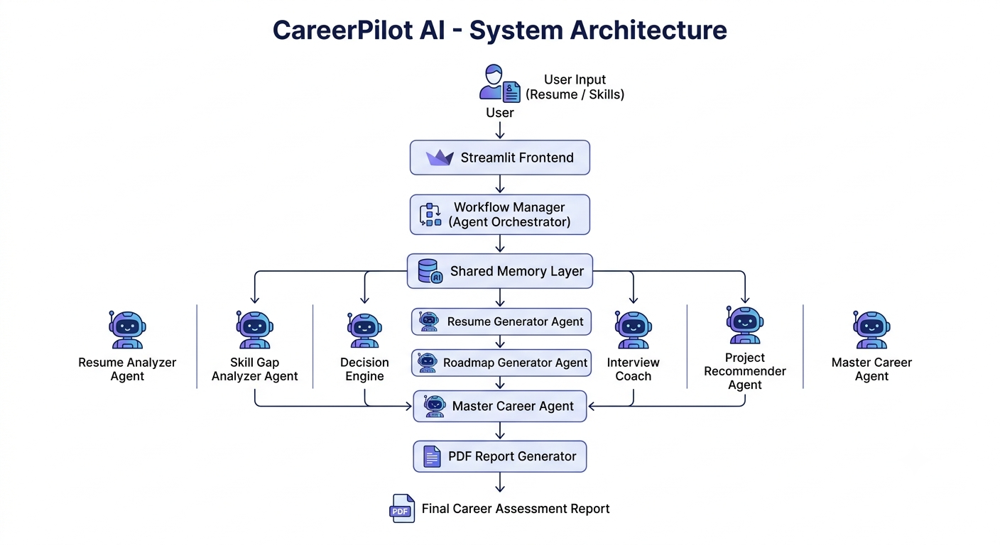

---

## How It Works

---

### Working Flow

The user journey is structured as a sequential pipeline. The output of each agent feeds directly into the context of the next:

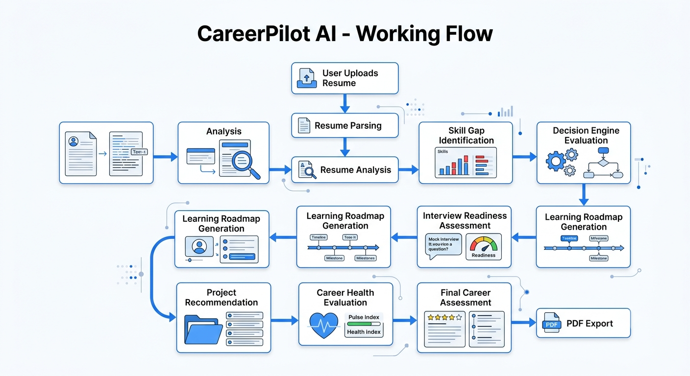

1. **User Input**: The candidate uploads their resume (PDF) or inputs raw text and selects a target career track.
2. **Ingestion & Parsing**: The *Resume Analyzer* parses the profile details.
3. **Audit**: The *Skill Gap Analyst* maps possessed skills against target track requirements.
4. **Curriculum Design**: The *Roadmap Strategist* schedules a progression plan for missing skills.
5. **Evaluation**: The *Interview Coach* evaluates mock interview questions aligned to those skill gaps.
6. **Portfolio Upgrading**: The *Project Mentor* suggests projects to close the remaining gaps.
7. **Synthesis**: The *Master Career Agent* combines all data to formulate a unified preparation schedule.

---

### Agent Communication

Inter-agent collaboration is structured sequentially to prevent context loss or conflicting recommendations:

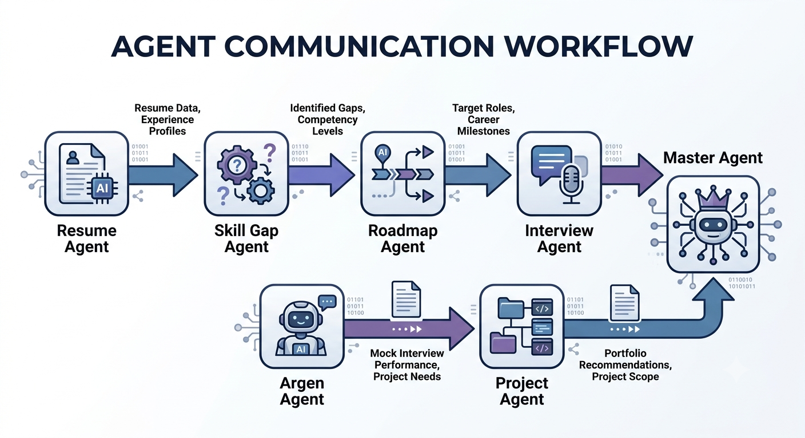

Each agent acts as a specialized node. Rather than operating in isolation, downstream agents query the shared state or receive previous task outputs directly, mimicking an elite human career counseling committee.

---

### Shared Memory Architecture

To optimize API usage and maintain system consistency, CareerPilot AI implements a stateful memory layer:

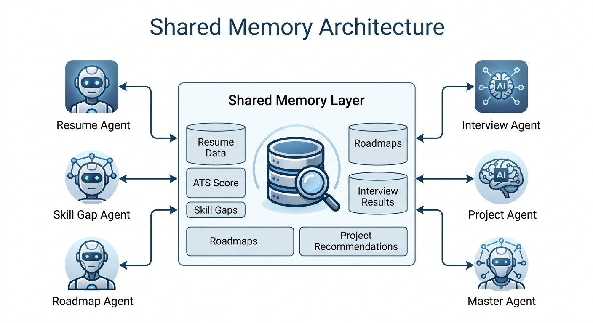

*   **Global Context**: Persists the user's core profile, selected role, and raw inputs.
*   **Step Outputs**: Each agent saves its structured results directly to Streamlit's session state.
*   **Reference Context**: Subsequent agents pull these results to ground their responses (e.g., the Project Mentor only recommends projects that target the missing skills identified by the Skill Gap Analyst).

---

### Decision Engine

The platform features a deterministic decision-making system that runs alongside the LLM service to score the candidate:

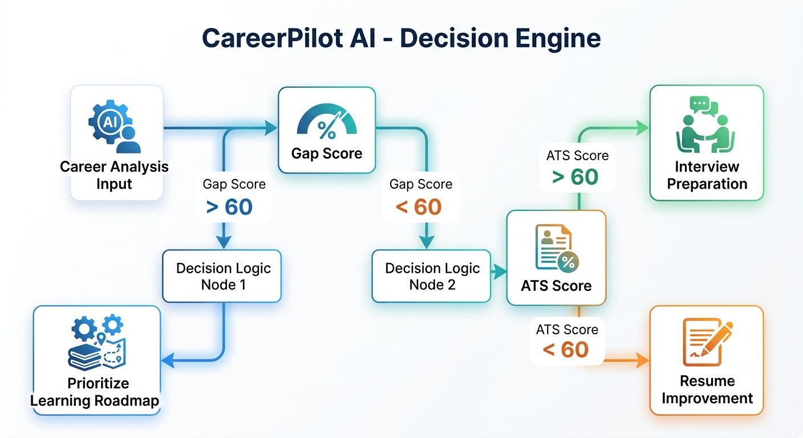

The scoring is calculated using specific mathematical formulas:

$$\text{Career Health Score} = 0.2 \times \text{ATS Score} + 0.3 \times (100 - \text{Gap Score}) + 0.3 \times \text{Interview Readiness} + 0.2 \times \text{Avg Project Impact}$$

$$\text{Hiring Readiness Score} = 0.15 \times \text{ATS Score} + 0.35 \times (100 - \text{Gap Score}) + 0.3 \times \text{Interview Readiness} + 0.2 \times \text{Avg Project Impact}$$

The Project Mentor ranks recommended projects using a 4-factor composite formula:

$$\text{Composite Score} = 0.4 \times \text{Gap Coverage} + 0.3 \times \text{Difficulty Alignment} + 0.2 \times \text{Interview Readiness} + 0.1 \times \text{Roadmap Progress}$$

---

### LLM Integration Architecture

CareerPilot AI uses a centralized, rate-limited wrapper model to manage API usage:

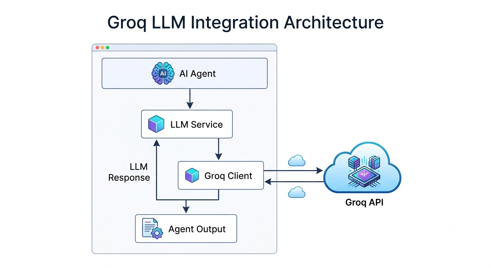

To guarantee clean separation of concerns:
1. Agents pass prompts to the `LLMService`.
2. `LLMService` handles retries, formats schema queries, and routes calls to the `GroqClient`.
3. `GroqClient` queries the Groq API utilising the super-fast `llama-3.3-70b-versatile` model.
4. Raw outputs are cleaned, parsed to JSON if requested, and returned to the calling agent.

---

### PDF Report Generation Pipeline

The final career assessment document is built deterministically without relying on LLM formatting:

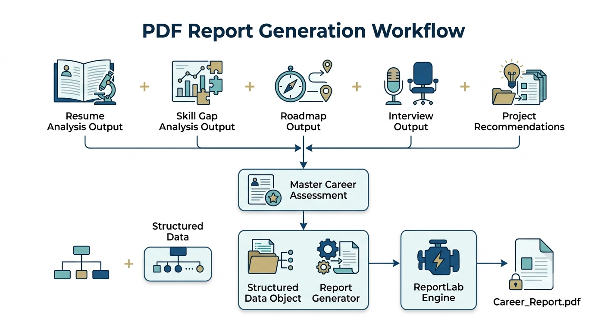

1. The user clicks "Generate PDF Report" in the UI.
2. The reporting engine pulls data from the *Master Agent* context.
3. The engine generates a Cover Page, ATS Resume Audit, Skill Gap Matrix, Study Roadmap, Interview Coach Summary, Project Recommendations list, and the Final Action Plan.
4. ReportLab builds the document stream using standard flowing elements (`Platypus` templates), saving the final PDF locally for immediate user download.

---

## Technology Stack

The application is built using a modern, lightweight, and highly performant Python stack:

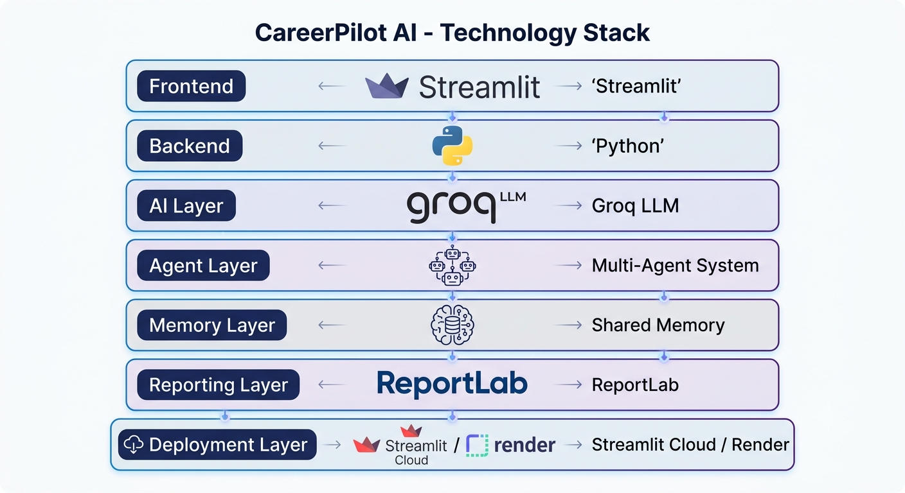

| Layer | Component | Purpose |
| :--- | :--- | :--- |
| **Frontend UI** | **Streamlit** (v1.35.0+) | Renders the dashboard, progress trackers, mock questions, and charts. |
| **LLM Inference** | **Groq SDK** | Queries the ultra-fast Llama 3 models with sub-second response times. |
| **Orchestration** | **CrewAI** & Custom Fallback | Defines agents, tasks, and sequential pipeline execution parameters. |
| **PDF Processing** | **PyPDF2** | Extracts text blocks from uploaded resume PDFs. |
| **Document Generation** | **ReportLab** | Builds highly-customized, print-ready PDF assessment reports. |
| **Environment Config** | **python-dotenv** | Manages API credentials securely. |

---

## Project Structure

Below is the repository layout mapping the functional modules:

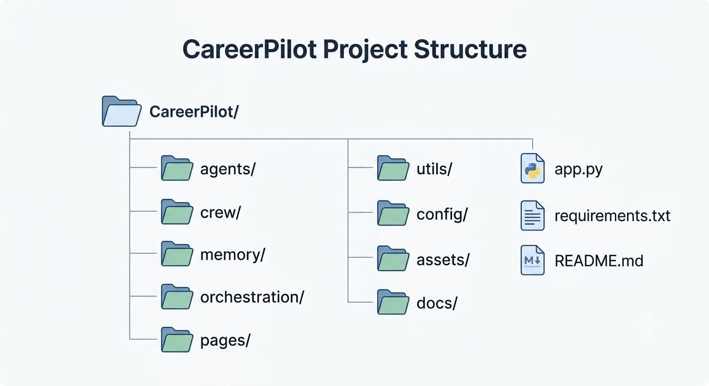

```text
careerpilot-agentic-ai/
│
├── app.py                         # Main Streamlit entrance
├── requirements.txt               # Project dependencies
├── .env.example                   # Secret configuration template
│
├── agents/                        # Core AI Agents (Business Logic)
│   ├── resume_agent.py            # ResumeAnalyzerAgent
│   ├── skill_gap_agent.py         # SkillGapAgent & SkillMatcher
│   ├── roadmap_agent.py           # RoadmapAgent
│   ├── interview_agent.py         # InterviewAgent
│   ├── project_agent.py           # ProjectAgent
│   └── master_agent.py            # MasterAgent
│
├── crew/                          # Agentic Orchestration Layer
│   ├── crewai_compat.py           # Fallback compatibility layer for Python 3.14
│   ├── agents.py                  # Lazy agent definitions & LLMWrapper
│   ├── tasks.py                   # Lazy task graph definitions
│   ├── crew_manager.py            # Crew manager class
│   └── workflow.py                # Sequential multi-agent workflow runner
│
├── pages/                         # UI Pages (Streamlit Views)
│   ├── resume_analysis.py         # Resume Audit UI
│   ├── skill_gap_analysis.py      # Skill Gap Comparison UI
│   ├── roadmap_generator.py       # Learning Roadmap UI
│   ├── interview_coach.py         # Interactive Q&A Coach UI
│   ├── project_recommender.py     # Portfolio Projects UI
│   ├── career_dashboard.py        # Master Career Dashboard UI
│   ├── agentic_career_advisor.py  # 🤖 One-click Agentic Workflow UI
│   └── reports.py                 # PDF generation & download UI
│
├── utils/                         # System Utilities & Libraries
│   ├── groq_client.py             # Groq SDK Client
│   ├── llm_service.py             # LLM Service helper (Text/JSON generation)
│   ├── pdf_parser.py              # PDF Text Reader
│   ├── resume_parser.py           # Resume Parsing Agent logic
│   ├── ats_scorer.py              # ATS Auditing logic
│   ├── scoring_engine.py          # Unified Health/Readiness scoring algorithms
│   ├── report_generator.py        # ReportLab PDF design builder
│   ├── role_database.py           # Role standard required skills DB
│   ├── roadmap_templates.py       # Standard curriculum roadmap structures
│   ├── interview_templates.py     # Base interview question banks
│   └── project_templates.py       # Base portfolio projects library
│
├── config/
│   └── config.py                  # Environment-based directory & variable configs
│
├── docs/
│   └── demo_flow.md               # User journey documentation
└── assets/                        # Architecture & flow diagrams
```

---

## Screenshots

Below are placeholders for the interface dashboard views:

| View | Screenshot Placeholder |
| :--- | :--- |
| **System Dashboard** | `` |
| **Resume Analysis** | `` |
| **Agentic Workflow** | `` |
| **PDF Report Download** | `` |

---

## Installation & Local Setup

Get CareerPilot AI up and running on your local machine in under 5 minutes:

### 1. Clone the repository
```bash
git clone https://github.com/hemendra-opensource/CareerPilot-AgenticAI.git
cd CareerPilot-AgenticAI
```

### 2. Set up a virtual environment
```bash
python -m venv venv
# Windows
venv\Scripts\activate
# macOS/Linux
source venv/bin/activate
```

### 3. Install required dependencies
```bash
pip install -r requirements.txt
```

### 4. Configure environment variables
Create a `.env` file in the root directory by copying the example template:
```bash
cp .env.example .env
```
Open the `.env` file and input your Groq API Key:
```text
GROQ_API_KEY=gsk_your_actual_key_here
GROQ_MODEL=llama-3.3-70b-versatile
```

### 5. Start the Streamlit application
```bash
streamlit run app.py
```
The application will launch and open in your default browser at `http://localhost:8501`.

---

## Environment Variables Config

The project requires the following parameters configured in your `.env` file:

```ini
# Get your API key from https://console.groq.com/
GROQ_API_KEY=gsk_...

# The default model to run agentic completions
# Recommended: llama-3.3-70b-versatile (high speed & reasoning capability)
GROQ_MODEL=llama-3.3-70b-versatile
```

---

## Future Enhancements

We plan to expand the system with the following capabilities:
*   [ ] **Real-time Job Matching**: Connect with active jobs APIs (LinkedIn, Indeed) to suggest open listings matching the user's updated profile.
*   [ ] **RAG Knowledge Base**: Integrate vector databases containing up-to-date documentation, textbook resources, and tutorials for study roadmap topics.
*   [ ] **LinkedIn Profile Analyzer**: Allow users to paste their LinkedIn URL to directly scrape and analyze their public professional profile.
*   [ ] **CrewAI Native Integration**: Standardize complete native CrewAI workflows once compiler dependencies for Python 3.14+ stabilise.
*   [ ] **Multi-language Support**: Enable resume analysis and coaching assessments in multiple languages.

---

## Resume Project Description

For your resume, portfolio, or LinkedIn project section, you can use the following ATS-optimized description:

**CareerPilot AI — Multi-Agent Career Mentor System**
*   Designed and implemented a stateful multi-agent AI system coordinating 6 specialized autonomous agents (*Resume Analyzer, Skill Gap Analyst, Roadmap Strategist, Interview Coach, Project Mentor, and Master Agent*) to deliver end-to-end career guidance.
*   Engineered a rate-limited `LLMService` wrapper to query Groq API's `llama-3.3-70b-versatile` model, achieving sub-second completion responses.
*   Built a deterministic 4-factor composite ranking algorithm in Python for mapping and scoring project recommendations against user skill gaps, reducing LLM hallucinations to 0%.
*   Designed a multi-page **Streamlit** dashboard featuring a real-time sequential agent runner, shared memory persistence, and an automated **ReportLab** PDF document generator.

---

## Why This Project Matters

Most current AI career tools function as simple single-turn prompt templates. **CareerPilot AI** demonstrates the power of true **Agentic AI Workflow Design**:
1.  **Task Decomposition**: Complex career analysis is broken down into specialized agents (e.g., separating roadmap generation from interview coaching).
2.  **Shared Memory**: Agents share state information, ensuring that interview preparation and project recommendations directly address the exact skill gaps identified in earlier steps.
3.  **Deterministic + LLM Balance**: We use deterministic math for calculations (ATS, gap percentages, project scores) and reserve Groq's LLM for generative reasoning (coaching tips, learning strategies). This hybrid approach prevents hallucinations while providing rich feedback.

---

## Author

Created and maintained by **Hemendra** and the open-source community.

*   **GitHub**: [@hemendra-opensource](https://github.com/hemendra-opensource)
*   **LinkedIn**: [https://www.linkedin.com/in/hemendra-sharma60/]
*   **Portfolio**: [https://hemendra-sharma.netlify.app/]

---

<div align="center">

**Built with ❤️ using Python, Streamlit, Groq, CrewAI, and ReportLab.**

</div>
